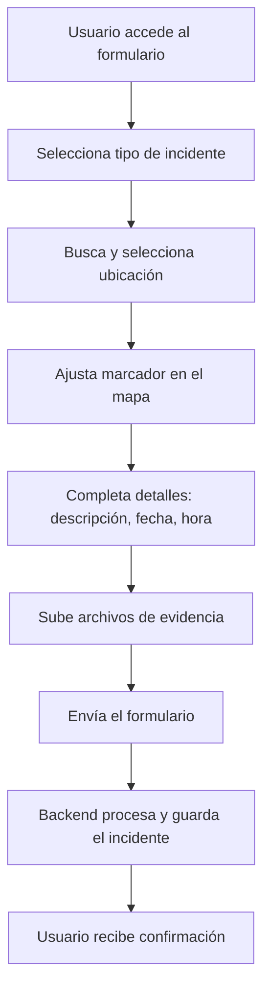

# 📄 Proceso y Funcionamiento del Formulario de Reporte de Incidentes

## 1. Propósito General
El formulario de reporte permite a los usuarios informar incidentes de seguridad o situaciones relevantes en la ciudad de Mar del Plata y alrededores, geolocalizándolos y adjuntando evidencia.

---

## 2. Estructura General del Formulario

El formulario está compuesto por las siguientes secciones principales:

1. **Tipo de Incidente (Etiquetas)**
2. **Ubicación (Búsqueda, Autocompletado y Mapa)**
3. **Detalles del Incidente (Descripción, Fecha y Hora)**
4. **Evidencia (Subida de Archivos)**
5. **Envío del Reporte**

---

## 3. Flujo Paso a Paso

### A. Selección de Tipo de Incidente
- El usuario puede elegir uno o varios tipos de incidente (robo, asalto, vandalismo, etc.) mediante botones visuales.
- Las etiquetas seleccionadas se resaltan y se agregan al estado del formulario.

### B. Selección de Ubicación
- El usuario puede buscar una dirección o lugar usando un campo de autocompletado.
- El autocompletado utiliza primero Google Places/Geocoding y, si no hay resultados, OpenStreetMap Nominatim, priorizando resultados en Mar del Plata.
- Al seleccionar una dirección, se muestra en un recuadro verde y se coloca un marcador en el mapa.
- El usuario puede ajustar la ubicación arrastrando el marcador en el mapa.
- El sistema guarda tanto la dirección formateada como las coordenadas GPS.

### C. Detalles del Incidente
- El usuario debe ingresar una **descripción** del hecho.
- Debe seleccionar la **fecha** y la **hora** en que ocurrió el incidente.
- Estos datos se validan para que no queden vacíos.

### D. Subida de Evidencia
- El usuario puede subir archivos como imágenes, PDFs o documentos Word (máx. 10MB por archivo).
- Los archivos se muestran en una lista, permitiendo eliminar los que no desee adjuntar antes de enviar.
- Los archivos se almacenan en Supabase Storage, y se guarda la URL pública en la base de datos.

### E. Envío del Reporte
- Al enviar, se valida que todos los campos obligatorios estén completos y que haya una ubicación válida.
- Se crea un objeto `FormData` con todos los datos y archivos.
- Se envía una petición `POST` a `/api/incidents`.
- El backend procesa la información, sube los archivos a Supabase, guarda el incidente en MongoDB y responde con éxito o error.
- Si el envío es exitoso, se muestra un mensaje de confirmación y se redirige al usuario.

---

## 4. Tecnologías y APIs Involucradas

- **Frontend:** React/Next.js, componentes personalizados, hooks de estado.
- **Geocoding:** Google Places/Geocoding API y OpenStreetMap Nominatim (fallback).
- **Mapa:** Componente de mapa interactivo (Leaflet, Mapbox, etc.).
- **Backend:** Next.js API Routes.
- **Base de datos:** MongoDB (colección `incident_draft`).
- **Almacenamiento de archivos:** Supabase Storage.
- **Autenticación:** NextAuth (el usuario debe estar autenticado para reportar).

---

## 5. Validaciones y Seguridad

- Solo usuarios autenticados pueden enviar reportes.
- Se valida la ubicación, la descripción, la fecha y la hora.
- Los archivos se validan por tipo y tamaño antes de subir.
- El backend verifica la autenticidad y los permisos antes de guardar el incidente.

---

## 6. Diagrama de Flujo del Proceso

---

## 7. Notas Adicionales

- El sistema prioriza la precisión local (Mar del Plata) en la búsqueda de direcciones.
- El usuario puede reportar desde cualquier dispositivo, pero la UI está optimizada para móvil.
- El proceso es robusto ante fallos de geocoding gracias al fallback a OpenStreetMap.

---

## 8. Archivos de Referencia y Consideraciones Importantes

### Archivos Clave

- **Frontend:**
  - `src/app/components/MobileReportForm.tsx` → Formulario principal de reporte para móvil.
  - `src/app/components/IncidentForm.tsx` → Formulario de reporte para escritorio.
  - `src/app/components/GeocodeSearch.tsx` → Componente de búsqueda y autocompletado de direcciones.
  - `src/app/components/Map.tsx` → Componente de mapa interactivo.

- **Lógica de Geocodificación:**
  - `src/lib/geocoding.ts` → Funciones utilitarias para geocoding y reverse geocoding.
  - `src/app/api/geocode/route.ts` → Endpoint API para geocodificación y fallback a OpenStreetMap.

- **Backend y Almacenamiento:**
  - `src/app/api/incidents/route.ts` → Endpoint API para crear y consultar incidentes.
  - `src/lib/incidentService.ts` → Funciones para consumir la API de incidentes desde el frontend.
  - `src/lib/supabase.ts` → Configuración de Supabase para almacenamiento de archivos.

- **Autenticación:**
  - `src/app/api/auth/[...nextauth]/auth.config.ts` → Configuración de NextAuth.
  - `src/middleware.ts` → Middleware de autenticación y control de acceso a rutas.

### Consideraciones Importantes

- **Variables de Entorno:**
  - Asegúrate de tener configuradas las variables de entorno para las APIs de Google y Supabase (`GOOGLE_MAPS_API_KEY`, `NEXT_PUBLIC_SUPABASE_URL`, `SUPABASE_SERVICE_ROLE_KEY`, etc.).
  - El endpoint de geocoding requiere que la API Key de Google tenga habilitados los servicios de Places y Geocoding.

- **Límites y Costos:**
  - El uso de Google Places/Geocoding puede tener costos asociados si se supera el límite gratuito.
  - OpenStreetMap Nominatim tiene límites de uso y debe usarse con moderación (no para producción masiva sin un servidor propio).

- **Seguridad:**
  - Solo usuarios autenticados pueden reportar incidentes.
  - Los archivos subidos se validan por tipo y tamaño, y se almacenan en Supabase Storage.
  - El backend valida todos los datos antes de guardar el incidente.

- **Extensibilidad:**
  - El sistema está preparado para agregar nuevos tipos de incidentes, campos adicionales o integraciones con otros servicios de mapas.
  - El formulario es fácilmente adaptable para escritorio y móvil.

- **UX/UI:**
  - El autocompletado prioriza resultados locales, pero permite búsquedas más amplias si no se encuentra nada en Mar del Plata.
  - El usuario puede ajustar la ubicación manualmente en el mapa para mayor precisión.

- **Testing:**
  - Se recomienda probar el flujo completo en distintos dispositivos y navegadores.
  - Verificar la subida y visualización de archivos de evidencia.

---
